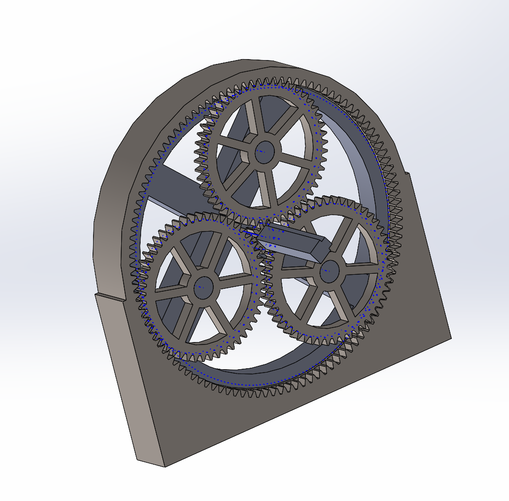
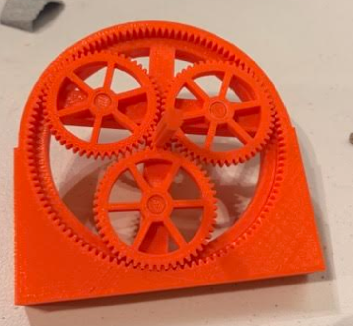
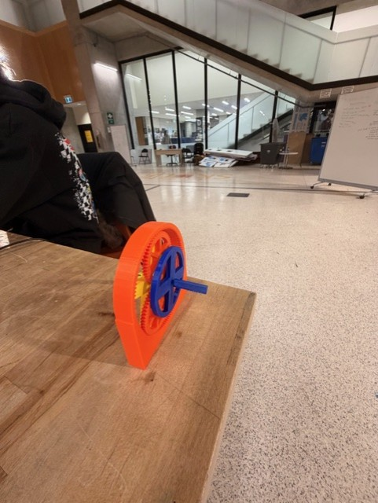
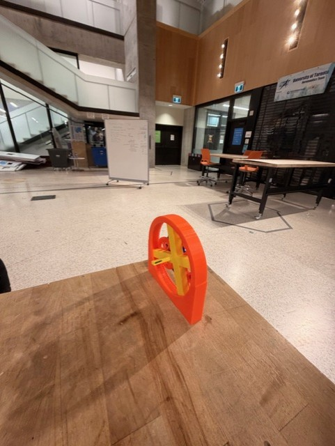

# Planetary-Gear-Box-Group-Project
Designed as part of a team in MIE243: Mechanical Engineering Design I, we aimed to create at 12:1 speed reduction gearbox 3D printed with a maximum of 6 hours of print time. We opted for the bonus marks by making the input and output shafts colinear.

**Highlights**
- **Acheived Co-Linear Shaft Design:** Planetary gear box design enabled colinearity.
- **Wiring Friendly:** All ports and wire connections have openings, even on the lid. Allows for no hinderance to use whilst protecting fragile components.
- **To be 3D printed:** Allows for protptyping and reiteration.
## 🔗 Project Resources
⚙️ [Planetary Gear Box First Print CAD Model](https://github.com/axelpengineering/Planetary-Gear-Box-Group-Project/blob/main/PlanetGearBoxRajanCADPic)

📄 [Final Assembly Instructions](https://docs.google.com/document/d/1uY-xgT_I0ulgbgxKAd_XPG4qrg5PrZTFMGNxh6vqa9I/edit?usp=sharing)

🎬 [Gearbox In Action](https://github.com/user-attachments/assets/0c576fa9-7703-4a8e-aefc-6920fa893a89)
*CAD credit to Rajan Arasarathnam and Muneeb Abid.

---
## Results
**First Major Print**
- Gears all meshed after sanding
- Gears pop out of ring gear after sufficient spin
- Sun gear cylindrical shaft too loose to transfer torque
- Input shaft broke after being turned by a drill

**Second Major Print**
- Gears work fine with no issues, no more popping out
- Input shaft broke after being turned by a drill

**Third Major Print**
- We printed the shaft sideways which increased the shafts strength against shear fracture.

**Personal Outcomes From Experience**
- Problem solving
- Working with gearboxes
- Learning about 3D printing conventions and issues.
- Collaborating on CAD/solidworks projects
- Robotics often requires use of gearboxes and components needed to be designed in CAD. These mechanical skills will translate seemlessly.

